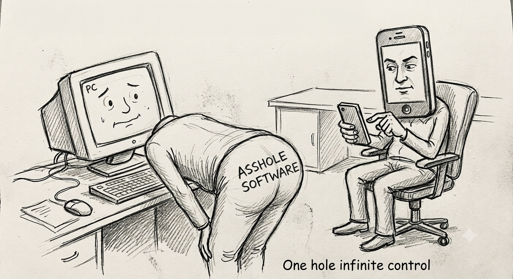

# 🕳️ ASSHOLE DECK

> **Your PC. Your phone. One unnecessarily powerful asshole. 💀**
> **ONE HOLE INFINITE CONTROL. 💀**

ASSHOLE DECK is a local Wi-Fi PC remote that lets you control your computer from your phone using a browser.

No mobile app. No cloud. No bullshit.  
Just scan the QR code → open WebUI → **take control.** 📱➡️💻

---

## 😂 Why?

Because apparently a keyboard and mouse weren't enough.

So I made this.

<p align="center">
  
</p>

> **The bigger the hole, the bigger the control.** 🕳️

---

## 🎛️ What Can It Do?

- 🖱️ **Mouse Control** — Move, left click, right click & more
- ⌨️ **Keyboard Control** — Send keyboard keys and shortcuts
- 🎵 **Media Control** — Play, pause, stop, next, previous & volume [Better control in VLC (Audio track change, Subtitle On Off)]
- 🔊 **Soundboard** — Inbuilt soundboard Play sounds directly on your PC, using webui
- 🚀 **App Launcher** — Launch your favorite PC applications
- 🔗 **Custom Shortcuts** — Create your own shortcuts
- 📂 **File & Media Browser** — Browse, open and download files
- 📸 **Screenshot & Screen record** — Capture your PC screen remotely
- ☀️ **Brightness Control** — Control screen brightness
- 🔊 **System Controls** — Control supported PC functions
- 📱 **QR Connection** — Scan and connect instantly
- 📡 **LAN Remote** — Control your PC over local Wi-Fi
- ⚙️ **Custom Configuration** — Configure folders, apps, sounds & shortcuts

Basically:

> **If your PC can do it, I probably added a button for it.** 💀

---

# 🖥️ PC Dashboard

The desktop application runs the server and provides the local control system.

<p align="center">
  
</p>

---

# 📱 WebUI

Open this from your phone's browser and control the PC remotely.

<p align="center">
  
</p>

---

## 🧠 How It Works

```text
📱 Phone
   │
   │ Wi-Fi
   ▼
🌐 WebUI
   │
   │ Socket.IO
   ▼
🖥️ Python Server
   │
   ├── 🖱️ PyAutoGUI
   ├── 🔊 pygame
   ├── 📂 File System
   └── ⚙️ Windows Controls

---
```
### 🖤 Made With Questionable Decisions

Built with ❤️, Python 🐍, caffeine ☕ and absolutely no common sense.

**Created by [Tarun Sharma](https://github.com/r0otpapa)**

> If it works, I made it.  
> If it breaks, it was probably a feature. 💀

**© 2026 Tarun Sharma — ASSHOLE DECK**
